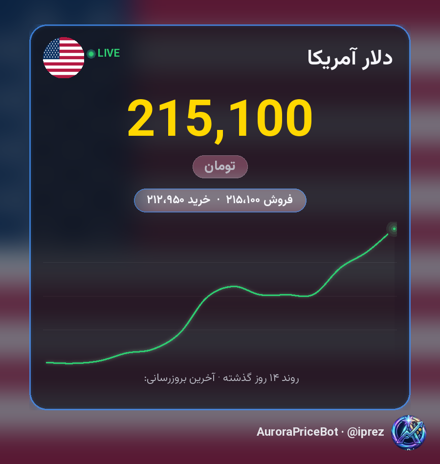
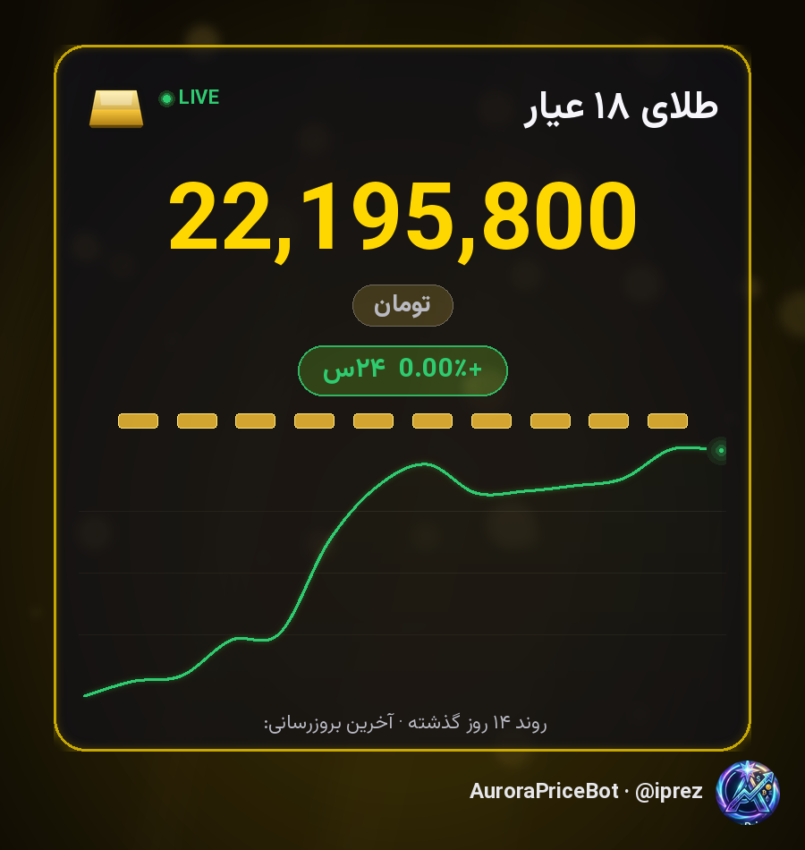
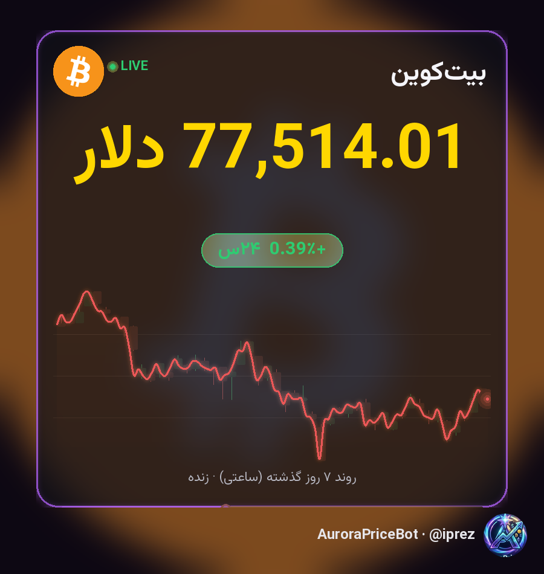
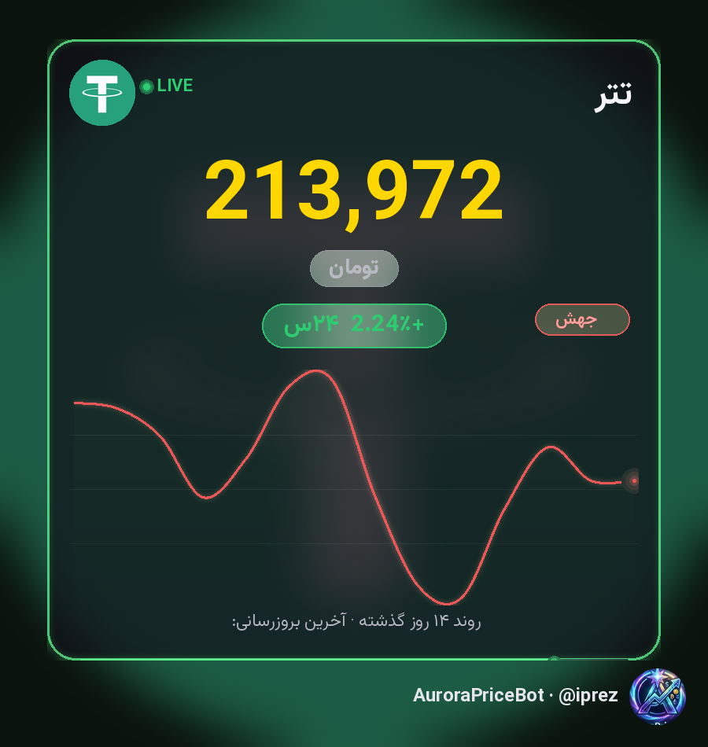
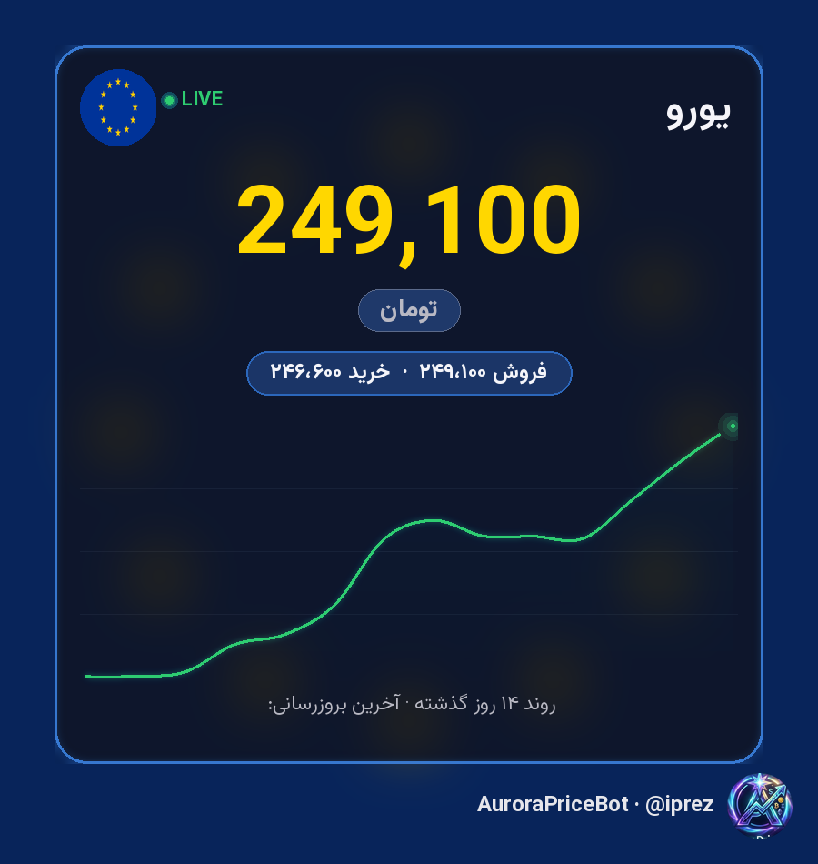

# 💱 AuroraPriceBot

> **ربات تلگرام قیمت لحظه‌ای ارز، طلا، سکه و رمزارز** — با بنرهای تصویری متحرک، طراحی لوکس و صفر وابستگی به کلید API.

[](https://www.python.org)
[](LICENSE)
[](https://railway.app)
[](https://t.me/iprez)

---

## 📋 فهرست مطالب

- [✨ نمای کلی](#-نمای-کلی)
- [🎯 ویژگی‌ها](#-ویژگیها)
- [🖼 گالری بنرها](#-گالری-بنرها)
- [🚀 نصب و اجرای محلی](#-نصب-و-اجرای-محلی)
- [🚂 دیپلوی روی Railway](#-دیپلوی-روی-railway)
- [📖 راهنمای دستورات](#-راهنمای-دستورات)
- [🧮 ماشین‌حساب ارز](#-ماشینحساب-ارز)
- [🛠 پنل ادمین](#-پنل-ادمین)
- [🏗 معماری سیستم](#-معماری-سیستم)
- [📊 منابع داده](#-منابع-داده)
- [⚙️ متغیرهای محیطی](#-متغیرهای-محیطی)
- [🔒 حریم خصوصی و امنیت](#-حریم-خصوصی-و-امنیت)
- [📜 لایسنس](#-لایسنس)
- [❓ سوالات متداول (FAQ)](#-سوالات-متداول-faq)

---

## ✨ نمای کلی

AuroraPriceBot یک بات تلگرام فارسی‌زبانه که قیمت‌های لحظه‌ای رو از چندین منبع معتبر جمع‌آوری کرده و به‌صورت **بنرهای تصویری گرافیکی** (عکس + گیف متحرک) برمی‌گردونه. برخلاف ربات‌های متنی ساده، اینجا هر قیمت با:

- 📈 نمودار ناحیه‌ای (Area chart) یا کندل‌استیک (Candlestick)
- 🔴🟢 نشانگر LIVE با پالس سینوسی
- 💎 حاشیه‌ی نئونی با تغییر رنگ پیوسته (آبی → بنفش → طلایی → سبز)
- ✨ ذرات معلق (Particle effects)
- 🔢 انیمیشن شمارنده‌ی قیمت (Count-up)
- 🥇 لوگوی شمش طلای ۳D برای خانواده‌ی طلا/سکه

نمایش داده می‌شه.

> 🇮🇷 **مخصوص بازار ایران:** قیمت‌های ریالی (دلار، طلا، سکه، تتر) از منابع داخلی و قیمت‌های جهانی ارز/رمزارز از Binance محاسبه می‌شن.

---

## 🎯 ویژگی‌ها

| دسته | پوشش | جزئیات |
|------|------|--------|
| 💵 **ارزهای فیات** | **۶۵ ارز** | دلار، یورو، پوند، درهم، لیر، فرانک، ین، روبل، دینار کویت، ریال عربستان، روپیه، وون و… |
| 🥇 **طلا و سکه** | **۸ مورد** | طلای ۱۸ عیار، ۲۴ عیار، سکه امامی، بهار آزادی، نیم‌سکه، ربع‌سکه، گرمی، شمش |
| 💎 **تتر (USDT)** | بازار داخلی | قیمت ریالی لحظه‌ای + معادل دلاری |
| 🪙 **رمزارزها** | **۲۹ کریپتو** | بیت‌کوین، اتریوم، سولانا، تون، ریپل، دوج‌کوین، شیبا، پپه و… |
| 🧮 **ماشین‌حساب** | + − × ÷ | «۱۲۵ دلار»، «۲ گرم طلا»، «۰.۵ بیت‌کوین» — با اعداد اعشاری |
| 🎠 **کارت چرخشی** | Carousel | دکمه‌های ◀️ ▶️ برای جابجایی بین ارزهای محبوب |
| 🟢 **حالت LIVE** | Real-time | نشانگر پالس‌دار + نمودار نوسان ۲۴ ساعته |
| 👻 **حالت Ghost** | خاموشی هوشمند | فقط به دستورات مستقیم جواب می‌ده؛ توی گپ شلوغ اذیت نمی‌کنه |
| 🛠 **پنل ادمین** | OWNER-only | آمار کاربران، گروه‌ها، نمودار ۷روزه، ارسال همگانی |
| 🚀 **کش ۲۰-۶۰ ثانیه‌ای** | Anti-rate-limit | بدون نیاز به کلید API، بدون بن شدن |

---

## 🖼 گالری بنرها

بنرها به‌صورت خودکار تولید می‌شن (هیچ تصویر دستی وجود نداره):

| دلار آمریکا | طلای ۱۸ عیار | بیت‌کوین | تتر (USDT) | یورو |
|:---:|:---:|:---:|:---:|:---:|
|  |  |  |  |  |

> 💡 **نکته:** بنرهای بالا لحظه‌ای توسط خودِ کد تولید می‌شن. در نسخه‌ی متحرک (GIF)، شمارنده قیمت از صفر شروع می‌کنه و نئون دور کارت رنگ عوض می‌کنه.

---

## 🚀 نصب و اجرای محلی

### پیش‌نیازها
- Python 3.11+
- توکن ربات از [@BotFather](https://t.me/BotFather)

### مراحل

```bash
# ۱. کلون ریپو
git clone https://github.com/abapqlcm/aurora-pricebot.git
cd aurora-pricebot

# ۲. نصب وابستگی‌ها
pip install -r requirements.txt

# ۳. تنظیم توکن
export BOT_TOKEN="توکن_ربات_شما"

# ۴. اجرا
python bot.py
```

ربات آماده‌ست — در تلگرام `/start` رو بزن!

---

## 🚂 دیپلوی روی Railway

۱. ریپو رو به [Railway](https://railway.app) وصل کن (Import from GitHub).
۲. متغیر محیطی `BOT_TOKEN` رو اضافه کن.
۳. Railway به‌طور خودکار از `Procfile` / `railway.json` استفاده می‌کنه:
   - **Start Command:** `python bot.py`
   - **فریم‌ورک:** None (Long-polling)

```bash
# یا با CLI:
railway link
railway up
```

> ⚡ ربات از `python-telegram-bot` با حالت Polling استفاده می‌کنه — نیازی به webhook نداره.

---

## 📖 راهنمای دستورات

| دستور | توضیح |
|-------|-------|
| `/start` | خوش‌آمدگویی + منوی سریع (دکمه‌های Inline) |
| `/admin` | 🛠 پنل ادمین (فقط مالک — OWNER) |
| `/cancel_bc` | لغو ارسال همگانی در حال انجام |
| `/ping` | تست پینگ (TCP خالص + Telegram TLS) |

### 💬 استفاده به‌صورت چت (Ghost mode)

فقط کافیه اسم ارز رو بنویسی — بدون دستور:

```
دلار          → بنر قیمت دلار
طلا           → بنر طلای ۱۸ عیار
بیت‌کوین       → بنر BTC
یورو اروپا     → بنر یورو
تون           → بنر تون‌کوین
بازار          → گرید بازار امروز
```

> 👻 **Ghost mode:** ربات فقط به پیام‌های کوتاه (≤۳ کلمه) جواب می‌ده — توی گپ‌های شلوغ اذیت نمی‌کنه.

---

## 🧮 ماشین‌حساب ارز

فقط **عدد + اسم ارز** بنویس — ربات محاسبه می‌کنه:

```
125 دلار        → ۱۲۵ × قیمت دلار
2 گرم طلا       → ۲ × قیمت هر گرم طلا
0.5 بیت‌کوین     → ۰.۵ × قیمت BTC
758.45 طلا      → محاسبه با اعداد اعشاری ✓
1.27 دلار       → پشتیبانی کامل اعشار ✓
```

> 🐞 **باگ قبلی حل شد:** نسخه‌های قبلی با اعداد اعشاری ارور می‌دادن — الان کاملاً اصلاح شده.

---

## 🛠 پنل ادمین

با دستور `/admin` (فقط برای مالک ربات):

- 👥 **کاربران** — آمار کل، فعال ۲۴ساعته، فعال ۷روزه
- 👨‍👩‍👧‍👦 **گروه‌ها** — تعداد گروه‌های فعال
- 📈 **نمودار ۷روز** — رشد استفاده
- 🏥 **سلامت** — وضعیت منابع و منابع داده
- 📢 **ارسال همگانی** — Broadcast به همه‌ی کاربران (قابل لغو با `/cancel_bc`)

> ⛔ اگر کاربر غیرمالک `/admin` رو بزنه: «⛔ این بخش فقط برای مالک رباته.»

---

## 🏗 معماری سیستم

```
                         ┌─────────────────────────────┐
   Telegram User  ─────▶ │      AuroraPriceBot          │
                         │  (python-telegram-bot)       │
                         │         bot.py                │
                         └───────────┬─────────────────┘
                                     │
                    ┌────────────────┼────────────────┐
                    ▼                ▼                ▼
              ┌──────────┐   ┌────────────┐   ┌──────────────┐
              │ render.py│   │  banner.py │   │  datafeeds.py │
              │ (parse + │   │ (GIF/PNG   │   │ (sources:    │
              │  format) │   │  renderer) │   │  TGJU/Wallex/ │
              └──────────┘   └─────┬──────┘   │  Binance)     │
                                   │          └──────┬───────┘
                                   ▼                 ▼
                          ┌──────────────┐   ┌────────────────┐
                          │  catalog.py  │   │  alanchand.py  │
                          │ (ارز → نام)  │   │ (بازار روز)    │
                          └──────────────┘   └────────────────┘
```

### ماژول‌های اصلی

| فایل | مسئولیت |
|------|---------|
| `bot.py` | هندلرهای تلگرام، پنل ادمین، ارسال بنر/GIF، warm loop |
| `render.py` | پارس ورودی کاربر + فرمت‌بندی اعداد فارسی |
| `banner.py` | رندر بنر PNG/GIF (نمودار، نئون، ذرات، شمش طلا، شمارنده) |
| `datafeeds.py` | دریافت قیمت از TGJU / Wallex / Binance + کش |
| `catalog.py` | نقشه‌ی ارزها (کد → نام فارسی، پرچم، منبع) |
| `admin.py` | آمار و مدیریت کاربران |
| `alanchand.py` | منبع بازار روز (فallback) |

---

## 📊 منابع داده

| دسته قیمت | منبع اصلی | منبع جایگزین |
|-----------|-----------|--------------|
| ارز فیات ایران (دلار، یورو، طلا، سکه) | **TGJU** | Alanchand |
| تتر (USDT) ریالی | **Wallex** | Binance FX × نرخ |
| رمزارزها (BTC و…) | **Binance** | — |
| نرخ ارزهای جهانی | **Binance** (pair/USDT) | — |

> 🔄 **کش هوشمند:** هر منبع ۱۵-۶۰ ثانیه کش می‌شه تا از rate-limit جلوگیری بشه. Warm loop هم بنرهای پرکاربرد رو از قبل آماده نگه می‌داره (ارسال ~۰ms).

---

## ⚙️ متغیرهای محیطی

| متغیر | الزامی؟ | توضیح |
|-------|---------|-------|
| `BOT_TOKEN` | ✅ بله | توکن ربات از BotFather |
| `OWNER_ID` | اختیاری | ID تلگرام مالک (برای پنل ادمین) |

---

## 🔒 حریم خصوصی و امنیت

- 🚫 **بدون کلید API خارجی** — همه‌چی از منابع عمومی رایگان.
- 👻 **Ghost mode** — ربات توی گپ‌های عمومی فقط به دستورات مستقیم جواب می‌ده.
- ⛔ **محدودیت مالک** — پنل ادمین و broadcast فقط برای OWNER.
- 🔐 **توکن‌ها حساس** — `BOT_TOKEN` فقط از متغیر محیطی خونده می‌شه، هرگز هاردکد نمی‌شه.

---

## 📜 لایسنس

[MIT](LICENSE) — آزادانه استفاده، مود و منتشر کن.

---

## ❓ سوالات متداول (FAQ)

<details>
<summary><b>🤔 چرا ربات به بعضی پیام‌ها جواب نمی‌ده؟</b></summary>

ربات توی حالت **Ghost mode** است — فقط به پیام‌های کوتاه (≤۳ کلمه) و مستقیم جواب می‌ده تا توی گپ‌های شلوغ اذیت نکنه. اگه جواب نداد، دقیق‌تر بنویس (مثلاً «دلار آمریکا» به‌جای «قیمت دلار چنده الان؟»).

</details>

<details>
<summary><b>🧮 چرا محاسبه با اعداد اعشاری کار نمی‌کرد؟</b></summary>

در نسخه‌های قبلی باگی وجود داشت که اعداد اعشاری (مثل `1.27`) رو ارور می‌داد. در نسخه‌ی فعلی کاملاً حل شده و «۱.۲۷ دلار»، «۲.۴۵۶۹ بیت‌کوین» و «۷۵۸.۴۵ طلا» درست محاسبه می‌شن.

</details>

<details>
<summary><b>🇮🇷 قیمت تومانی کریپتو کجاست؟</b></summary>

برای هر رمزارز، زیر قیمت دلاری خط «≈ XXXX تومان» نمایش داده می‌شه (معادل ریالی بر اساس نرخ لحظه‌ای تتر).

</details>

<details>
<summary><b>⚡ چرا ربات اینقدر سریع بنر می‌فرسته؟</b></summary>

یک **Warm loop** در پس‌زمینه بنرهای پرکاربرد (دلار، طلا، BTC، تتر) رو از قبل رندر و کش می‌کنه، پس زمان ارسال تقریباً صفره.

</details>

<details>
<summary><b>🚂 چطور روی Railway دیپلوی کنم؟</b></summary>

ریپو رو import کن، متغیر `BOT_TOKEN` رو ست کن، و Railway خودش با `Procfile`/`railway.json` ربات رو اجرا می‌کنه. نیازی به webhook نیست.

</details>

---

<div align="center">

**ساخته‌شده با ❤️ توسط [@iprez](https://t.me/iprez)**

⭐ اگه خوشت اومد، به ریپو Star بزن!

</div>
